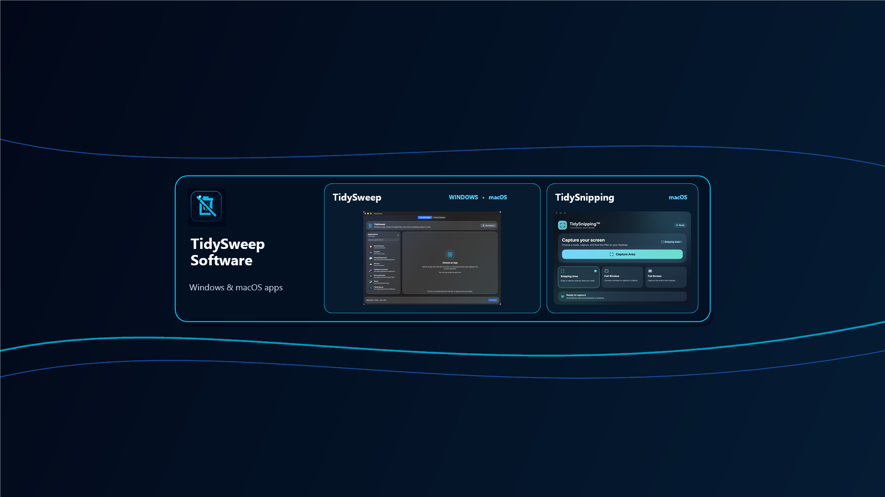
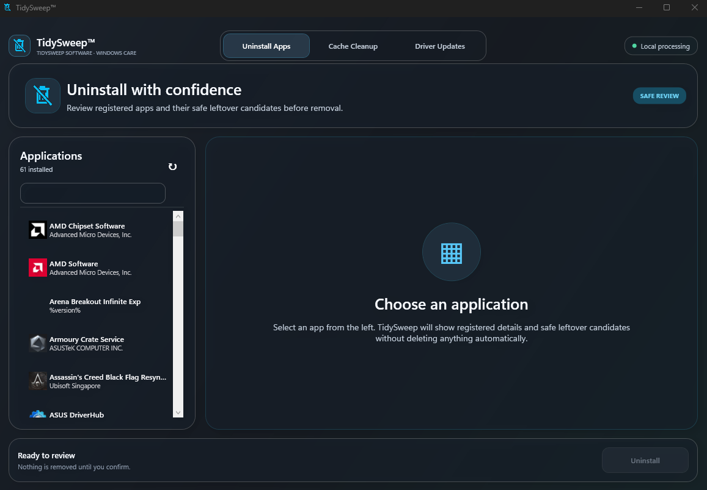
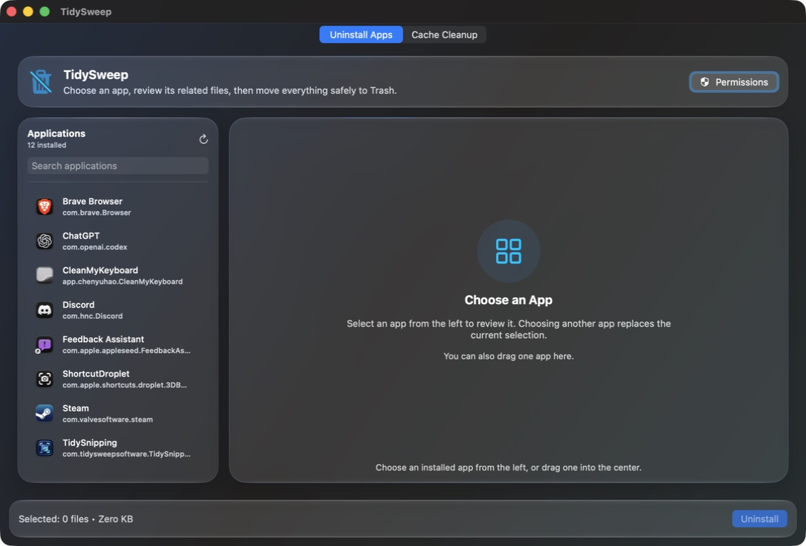
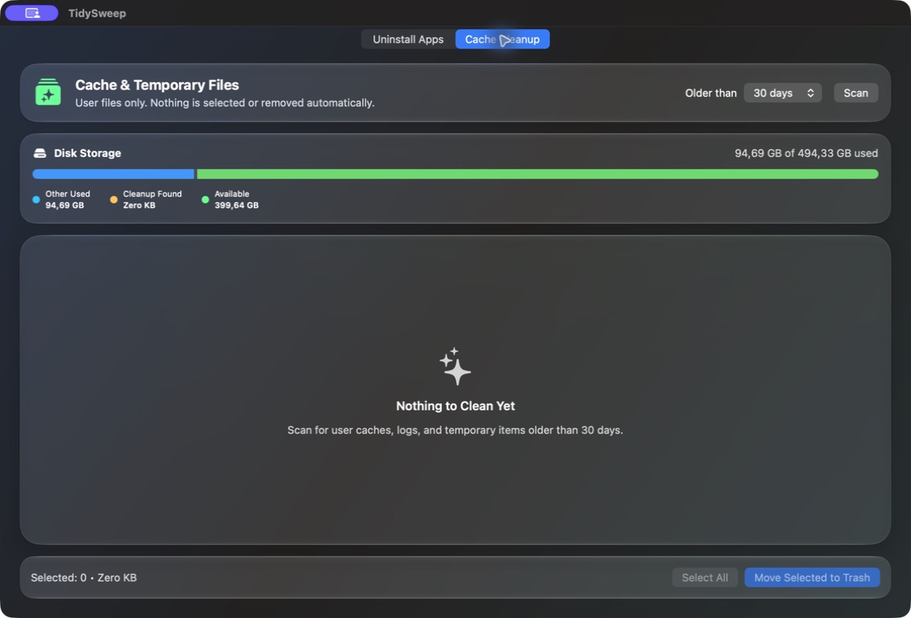
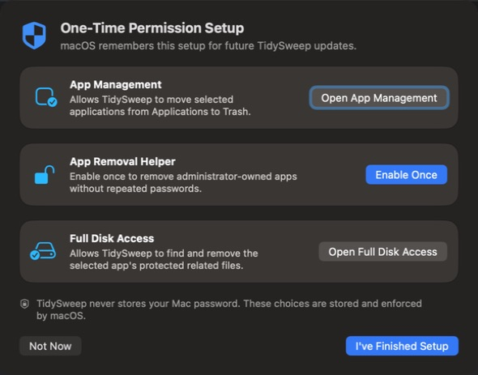
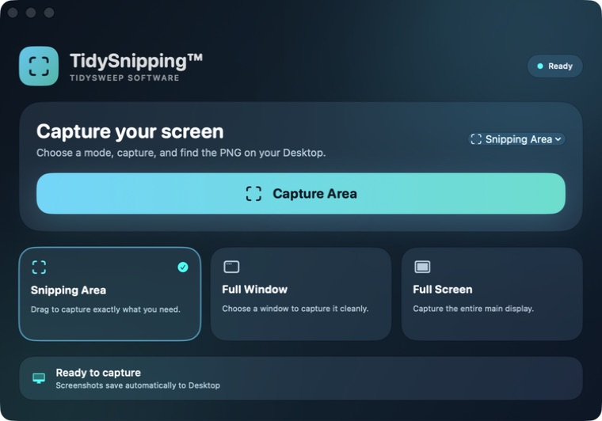
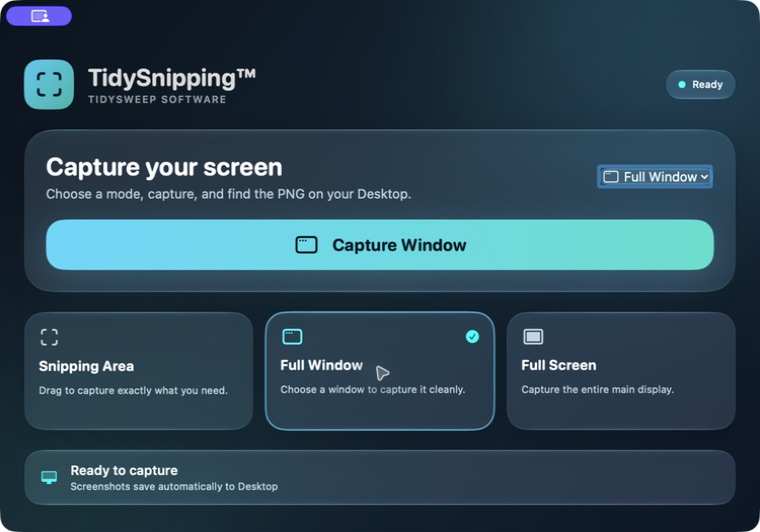
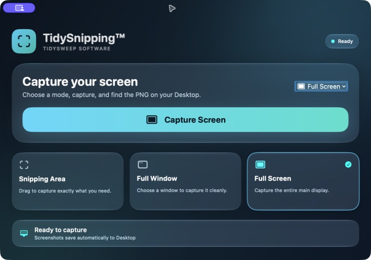

# TidySweep Software

Modern, friendly utilities for Windows and macOS. TidySweep Software focuses on local-first tools that simplify computer care and screen capture without accounts, subscriptions, or unnecessary data collection.

[Visit the official website](https://tidysweepsoftware-lgtm.github.io/TidySweep-Software-Releases/) · [Support the project](https://buymeacoffee.com/tidysweepsu) · [YouTube](https://youtube.com/@tidysweepsoftware)

## TidySweep for Windows

A Windows 10/11 maintenance utility for reviewing installed applications, cleaning unnecessary files, understanding disk usage, and checking official driver updates.

Now Available in Microsoft Store: https://apps.microsoft.com/detail/9n3pkcj18n99?hl=en-US&gl=DE

**Version 1.2.3 · Website installer available · Microsoft Store certification in progress**

[Download TidySweep 1.2.3 for Windows](https://github.com/tidysweepsoftware-lgtm/TidySweep-Software-Releases/releases/download/tidysweep-windows-v1.2.3/TidySweep-Setup-1.2.3.exe) · [Release details and signing notice](https://github.com/tidysweepsoftware-lgtm/TidySweep-Software-Releases/releases/tag/tidysweep-windows-v1.2.3)

> The website installer uses the current TidySweep Software self-signed certificate, not a publicly trusted commercial Authenticode certificate. Windows SmartScreen or antivirus software may still display a warning.

## TidySweep for macOS

Review installed applications, inspect related files, remove unwanted apps, and clean common caches through a calm, modern macOS interface.

  
  

  

[Download TidySweep 1.0.1 for macOS](https://github.com/tidysweepsoftware-lgtm/TidySweep-Software-Releases/releases/download/tidysweep-v1.0.1/TidySweep-1.0.1-macOS.dmg) · [Release details](https://github.com/tidysweepsoftware-lgtm/TidySweep-Software-Releases/releases/tag/tidysweep-v1.0.1)

## TidySnipping for macOS

A lightweight screenshot utility with area capture as the default, plus full-window and full-screen modes. Captures are automatically saved to the Desktop.

  
  

  

[Download TidySnipping 1.0.0 for macOS](https://github.com/tidysweepsoftware-lgtm/TidySweep-Software-Releases/releases/download/tidysnipping-v1.0.0/TidySnipping-1.0.0.dmg) · [Release details](https://github.com/tidysweepsoftware-lgtm/TidySweep-Software-Releases/releases/tag/tidysnipping-v1.0.0)

## Support and privacy

- [FAQ and installation help](https://tidysweepsoftware-lgtm.github.io/TidySweep-Software-Releases/faq.html)
- [Known issues](https://tidysweepsoftware-lgtm.github.io/TidySweep-Software-Releases/known-issues.html)
- [Privacy policy](https://tidysweepsoftware-lgtm.github.io/TidySweep-Software-Releases/privacy.html)
- [Report a bug](https://github.com/tidysweepsoftware-lgtm/TidySweep-Software-Releases/issues/new?template=bug_report.md)
- [Request a feature](https://github.com/tidysweepsoftware-lgtm/TidySweep-Software-Releases/issues/new?template=feature_request.md)
- Email: tidysweepsoftware@gmail.com

## Current macOS signing notice

The current macOS downloads are not yet Apple Developer ID signed or notarized. macOS may display a Gatekeeper warning. Installation instructions are available in the FAQ. Downloads are processed locally and do not require an account.

---

© 2026 TidySweep Software. TidySweep™ and TidySnipping™ are trademarks of TidySweep Software.
